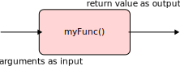

<!-- _header:  -->

# SFC Upskilling Course  - Technology and Skills for Engineering the Future

Functions

<!-- ```C
extern int add (int a, int b)
extern float add (float a, float b);
extern double add (double a,double b);
x = add(4, 0.3);
``` -->
Hasan T Abbas
[Hasan.Abbas@glasgow.ac.uk](mailto:Hasan.Abbas@glasgow.ac.uk)

<!-- transition: fade -->
<!-- <style scoped>a { color: #eee; }</style> -->

<!-- This is presenter note. You can write down notes through HTML comment. -->

--- 
# Functions



---
# Functions :bento:

- Functions are essentially small blocks of code that perform a specific task
Using functions makes the code *tidy*
- <span style="color:red"> *Divide and conquer* </span> strategy of problem-solving

```python
# Piecing it Together - Functions
def name( parameters or arguments ): # all functions are identifiable through the parantheses. Also note the : at the end
    statements # note again the indentation
```
---
# Basic Functions

```python
# An example function that prints a greeting message 

def howdy():
    # the actual body of the function
    print("Howdy!\n")
    print("How's it going?")
```
---

# Calling a function

```python
howdy()
```
---

# Calling a Function

- Whenever a function is called, we need to pass on the list of arguments or parameters
  
```python

# An example function that prints a greeting message 

def howdy2(name):
    # the actual body of the function
    print("Howdy! " + name + "\n")
    print("How's it going?")


howdy2("Fiona")
```

---

# Function Output

- Just we can provide parameters as input to a function, we can also generate an output from the function that can be returned.
- We use the keyword `return` to generate an output from a function.


```python
def square(x):
    y = x * x
    return y

toSquare = 10
result = square(toSquare)
print("The result of {} squared is {}.".format(toSquare, result))
```
---

---
# Program Organisation

## The Scope

- :warning: Caution is needed when passing variables from one function to another in a program
- Python has local, and external (global) variables
- *Local variables* are only <span style="color:green"> visible</span> inside a given function
- With each function call, by default, the value of a local variable is <span style="color:red"> lost</span>
