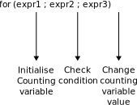
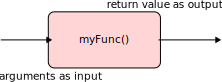
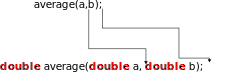

<!-- _header:  -->

# SFC Upskilling Course — Technology and Skills for Engineering the Future

Programming in C

Hasan T Abbas
Lecturer, James Watt School of Engineering
[Hasan.Abbas@glasgow.ac.uk](mailto:Hasan.Abbas@glasgow.ac.uk)

<!-- transition: fade -->
<!-- <style scoped>a { color: #eee; }</style> -->

<!-- This is presenter's note. You can write down notes through HTML comments. -->

--- 
# Introduction to C Programming

- A portable programming language 
- Extremely powerful and fast performance
- Compiler required to run C programs
- CPUs are often programmed in C

---

# Replit Repository
- We will use Replit to write and run C programs

[SFC Upskilling C](https://replit.com/@hasantahir2/SFC-Upskilling-C?v=1)

---

# Basic C Program

```C
#include <stdio.h>

int main(void)
{
  printf("Hello, World!\n");
  return 0;
}
```

---

# C Program Structure

```C
#include <stdio.h>
```

- Just like modules in Python, we include external libraries in the header section of the C program
- There are several libraries that enhance the functionality of a program
- `stdio.h` is a standard IO library with definitions for input and output functions

---

# C Program Structure

```C

int main(void)
{
  ...
}
```

- Every C program is going to include a `main()` function
- The `int` refers to a return data type which in this case is an integer
- `void` refers to the list of parameters or arguments that can be passed to the function
- The function body is determined by the `{}`
- Each line inside the block has a `;` in the end

---

# C Program Structure

```C
printf("Hello World\n");
```

- A printing function that displays a string on the screen
---

# Compiling a C Program

- Unlike Python, we have to first compile a C program
- A binary executable is created which can be then run on a CPU
- Typically a program such as a Terminal is used to run the C program

```zsh
gcc hello.c -o hello
./hello
```
---

# Variables and Data types

- Like Python, C has variables as placeholders to store data 
- Since C can access memory directly, there are several types of data that we can use
- Some are `float`, `double`, `int`, `char`, `short` etc.
- Variables in C therefore must be `typed` meaning we have to define the type.

```C 
int number = 0;
char initial = 'H';
double pi = 3.14156;
```

---

# Data type modifiers

- In embedded systems (think of a microcontroller) such as Arduino, Raspberry Pi, PIC etc -  memory comes at a premium
- We need to use and allocate memory carefully
- An `int` type variable is 4 bytes, if needed we can use `long` (8 B) or `short` (2 B) depending on the use
- We can also assign signed or unsigned values to the variables

---

# Directives

- We have seen `#include` earlier. In C it is called a pre-processor directive
- There are others such as `#define` that can be used to define constant values.

```C
#define PI 3.14156
```
----

# Operators

- C has a range of operators like arithmetic, relational and logical that we can use
- Relational (`<, >, >=, <=`) and logical (`&&, ||, !`) let us make decisions.

---

# Selection and Decisions

C has three kinds of statements (selection, iteration, jump) that can help make decisions and select choices.



Today we will look at `if` and `switch` statements along with relational and logical operators.

---

# Logical Expressions

We need to check an expression to see if it is `true` or `false`.

- Like, check whether `i < j` is `true` or `false`
- The above `(i < j)` is a logical expression.
- The result is an integer, `1` for true, and `0` for false
- We usually call it *Boolean* logic
- We can have relational operators such as `<`,`>`,`<=`,`>=` to *compare* two or more values

---

# Logical Operators

- Complex logical expressions are built by combining simpler ones
- This is done using the *logical operators*

| Symbol | Meaning |
| :---: | :--- |
| `!` | logical negation |
| `&&` | logical AND |
| `\|\|` | logical OR |

- The output of the logical expressions with logical operators is either `0` or `1`.

---

# Venn Diagram Visualisations

Logical operators are best understood using Venn diagrams


---

---

# The `if` `else` Statement

- Allows choosing between *two* choices

```C
if (expresssion)
    {statements1}
else
    {statements2}
```

---

# Loops in C

- Statements that are executed *repeatedly*
- Every loop has a *controlling expression*
- C has three kinds of loops
  1. `while`
  2. `do while`
  3. `for`

---

# The `while` loop

`while` is the simplest of the loops

- The controlling expression is executed <span style="color:red"> before</span> `the loop block.

```C
while (controlling expression)
{
    // statements
}
```

- Note there is no `;` in the first line
- Just like before `controlling expression` can be `true` or `false`



---

# <span style="color:orange">Example - `while` loop</span> :placard

Write a C program that calculates a number equal to the smallest power of `2` that is greater than or equal to `20`.

$$ x = 2 ^ i \ge n$$

```C
int i, n;
i = 1; n = 20;
while (i < n)
{
    i = i * 2;
}
printf("The smallest value is %d \n", i);
```



---

# <span style="color:orange">How Example worked</span> :placard

```
i = 1; i is now 1.
Is i < n? Yes; continue.
i = 1*2; i is now 2.
Is i < n? Yes; continue.
i = i*2; i is now 4.
Is i < n? Yes; continue.
i = i*2; i is now 8.
Is i < n? Yes; continue.
i = i * 2; i is now 16.
Is i < n? Yes; continue.
i = i * 2; i is now 32.
Is i < n? No; exit from loop.
```

---

# The <span style="color:red"> *infinite*</span> Loop

Sometimes we deliberately construct a condition that remains *true* all the time.

- When paired with a loop, we call this an infinite loop
- It executes forever until we tell the compiler to stop
- We can use `break` or some other ways to get out of the loop
- We commonly use infinite loops in embedded systems such as Arduino.

```C
while(1)
{
    // some statements inside
}
```

---

# The `for` Loop

- `for` loop is the most C-like thing in C
- Best way to write loops
- We have a *counting variable* that dictates the iterations
- Ideal for cases where we need to count *up* or *down*

```C
for( expr1 ; expr2 ; expr3){
    //statements
}
```



---

# <!--fit--> `for` Loop Examples


---

# Mixing Operators

- Create a `for` loop to *even* display numbers from 2 to 200.

```C
for (i = 2 ; i <= 200 ; i += 2){
    printf("%d\n",i);
} 
```

---

# Functions :bento

- Functions are essentially small blocks of code that perform a specific task
Using functions makes the code *tidy*
- <span style="color:red"> *Divide and conquer* </span> strategy of problem-solving
- We have seen functions like `scanf()` and `printf()` before

```C
return_type function_name (arguments);
```



---

# Basic Functions

```C
double sum (double in1, double in2){
  return in1 + in2;
}

double average (double in1, double in2){
  return (in1 + in2)/2;
}
int main(){
  double a = 3.13;
  double b = 5.53;
  printf("The sum of %lf and %lf is %lf", a, b, sum(a,b));
  printf("The average of %lf and %lf is %lf", a, b, average(a,b));
  return 0;
}
```

Here `sum` and `average` are the names of the functions that *accept* as input two `double` type variables. Both functions return `double` type outputs once they are called.

---

# Defining a function

```C
return_type function_name (arguments)
{
  //declarations 
  //statements
}
```

- Whenever we pass a variable as an argument to the function, we always <span style="color:red"> copy</span> its value
- A function can only *return* a single value
- We can also use `void` to indicate, a function doesn't return anything

---

# Calling a Function

- Whenever a function is called, we need to pass on the list of arguments
  
```C
average(a,b);
sum(a,b);
```

<span style="color:red"> WRONG</span> :x:

```C
average;
sum();
```

---

# Function Declaration

- Typically, we define the function *before* it is used, say in the `main()` function.

```C
int main(){
  double a = 3.13;   double b = 5.53;
  printf("The average of %lf and %lf is %lf", a, b, average(a,b));
  return 0;
}
double average (double in1, double in2){
  return (in1 + in2)/2;
}
```

- The compiler does not know what `average(a,b)` is about
- In this case, we can use *function prototype* or *declaration* before the `main()` function

```C
double average (double, double);
```

can be placed above the main function.

---

# Some Built-in Functions

- Just like we have used `scanf()` and `printf()` functions, there are various other functions that we can use without defining them
- `math.h` library contains definitions of common mathematical functions

```C
#include<math.h>
#include<stdio.h>

int main(){
  double pi = 3.14159;
  double trig_sin = sin (pi/4);
  printf("sine of %lf is %lf", (pi/4), trig_sin);
  return 0;
}
```

---

# Passing Arguments <span style="color:green"> *by value*</span>

- We have to be careful :warning: when passing the values as an argument.
- The list should exactly match and be in order as in the definition of the function
- When *passing by value* the original variables are not modified.



---

# Passing Arguments <span style="color:red"> *by reference*</span> :key

- In short, we *modify* the value of the original variable passed to the function
- More about this when we study pointers.
- For now, recall:

```C
scanf("%d",&v);
```

The `&` is the address operator used when we are going to pass the arguments by reference.

---


In this module, we will use [Replit](https://replit.com) which is an online integrated development environment to program Python and C codes.
 
We have set up a repository that can be accessed here:
[SFC Upskilling Repo](https://replit.com/join/ajpjdluhtl-hasantahir2)

